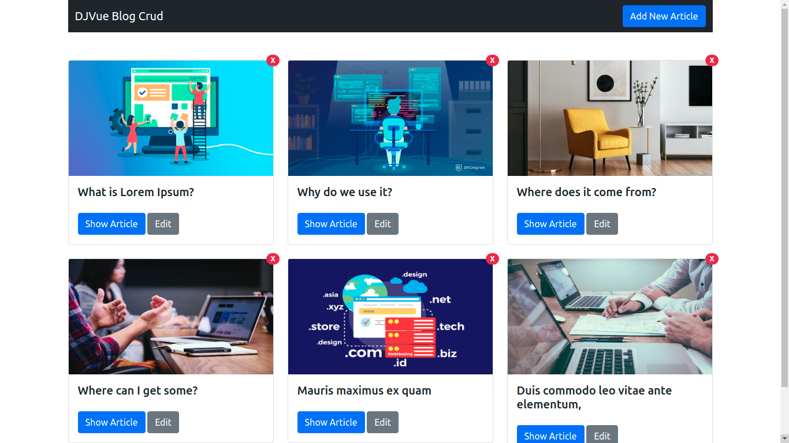
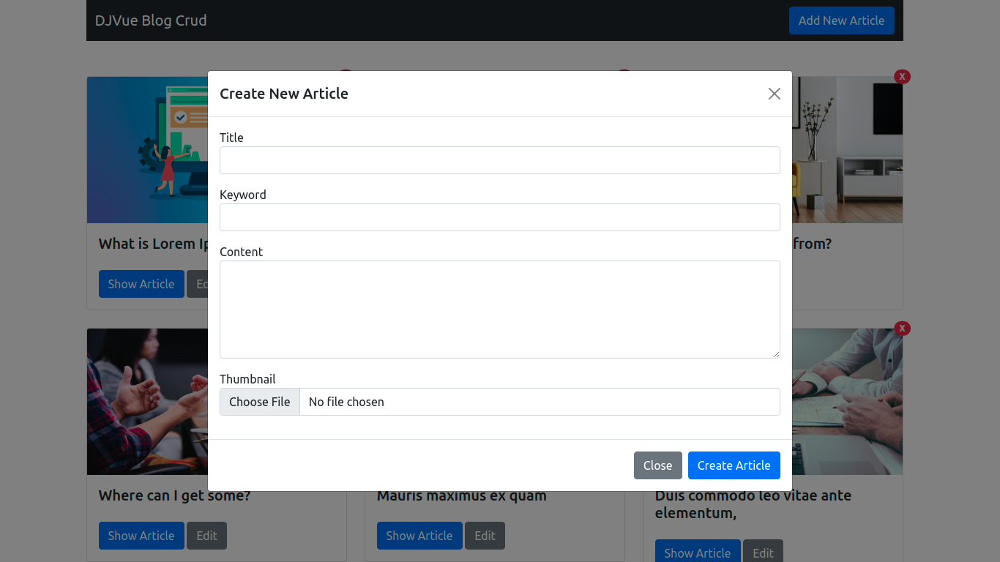
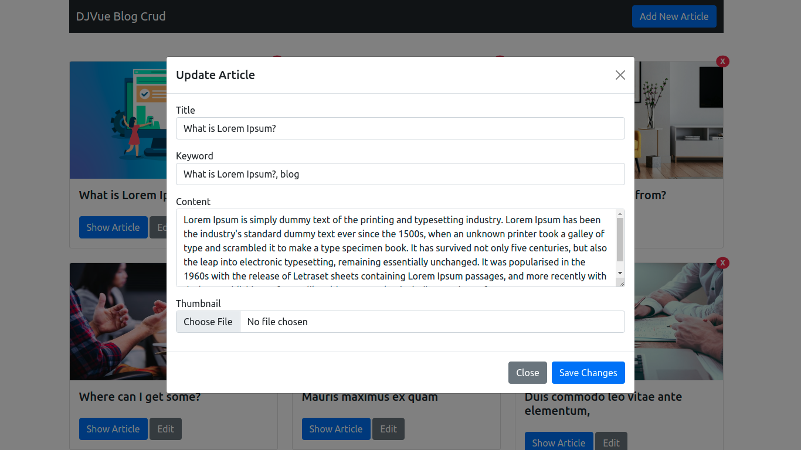
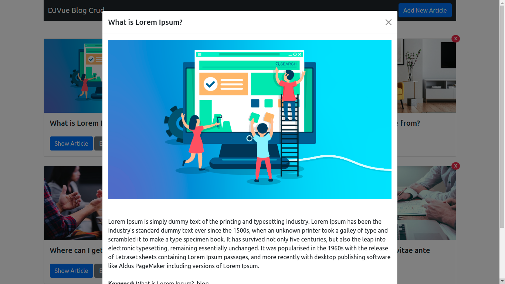

# CRUD App with Django & VueJs #

## Screenshot ##






## Features ##

* List Article
* Detail Article
* Create Article
* Update Article
* Delete Article

## API Endpoints ##

- List Articles

```
Method: GET
url: /api/article/
```

- Detail Articles

```
Method: GET
Url: /api/article/{id}/
```

- Create Articles

```
Method: POST
Url: /api/article/
```

- Update Articles

```
Method: PUT
Url: /api/article/{id}/
```

- Delete Articles

```
Method: DELETE
Url: /api/article/{id}/
```
